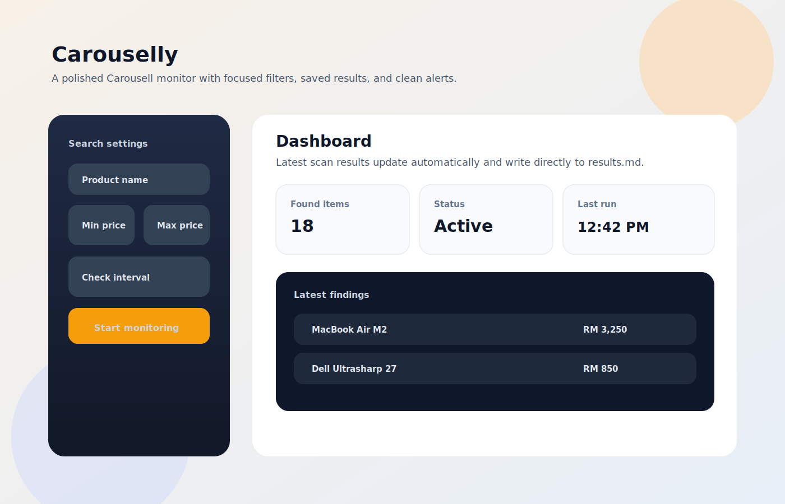

# Carouselly

Carouselly is a polished Carousell monitor built as a portfolio project: it lets you track a product name and price band, and it shows matching listings immediately in the dashboard as popup notifications and live results.



## What It Shows

- A clean Streamlit dashboard with explicit product, min price, and max price controls.
- Playwright-based scraping with local persistence in `seen_items.json`.
- A reusable core module that keeps scraping, parsing, and file handling separate from the UI.
- Popup notifications and a live results panel so new listings are visible immediately.
- A small CLI entry point for running a single scan from the terminal.

## Project Structure

- `app.py` is the Streamlit dashboard.
- `main.py` is the command-line runner.
- `carouselly_core.py` contains the shared scraper and file helpers.
- `tests/` contains unit tests for the reusable pieces.

## Quick Start

1. Install dependencies:
   ```bash
   pip install -r requirements.txt
   playwright install chromium
   ```
2. Copy the environment template:
   ```bash
   copy .env.example .env
   ```
3. Launch the dashboard:
   ```bash
   streamlit run app.py
   ```

Optional CLI scan:

```bash
python main.py --product-name "iPhone 15" --min-price 2500 --max-price 4000
```

## Streamlit Cloud Deploy

1. Keep `playwright` in `requirements.txt`.
2. Keep Linux runtime libraries in `packages.txt`.
3. Use `HEADLESS=true` in your environment.
4. On first run, if Chromium is missing, the app will auto-run `python -m playwright install chromium`.
5. If anti-bot challenges persist, set `PROXY_SERVER` to a residential proxy endpoint.

## Testing

Run the unit tests from the workspace root with:

```bash
pytest carouselly/tests
```

## Notes

- Telegram integration was removed from the UI and code path.
- Do not upload `.env`; it is local-only and already ignored by `.gitignore`. Share `.env.example` instead.
- The dashboard can run headless or visibly, depending on the checkbox in the sidebar.
- On Linux and Streamlit Cloud, headless mode is enabled by default.
- New listings are surfaced in the dashboard popups and latest-scan panel instead of a markdown export file.
